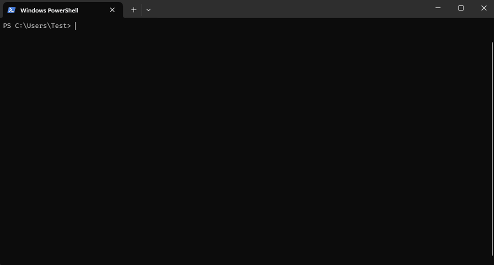

# Workspaces-rs
This project is a simple command-line utility to easily switch between directories in your OS.

Once you're in a project directory, you can add it as a workspace, and then use a fuzzy finder to open it. 
Since no process is allowed to modify the working directory of the terminal it runs on, this program saves
the chosen workspace in a text file, that can be then used as a parameter for the `cd` command. This 
README shows a simple way to do this both on Windows and Linux.



# Installation
For now, you can install this application only through the following command:
```sh
cargo install --git https://github.com/andreadev-it/workspaces-rs
```
This will build and install the executable in the `~/.cargo/bin` directory.

If you're running linux, you will need `libx11-dev` to build this project, since it's a dependency for
the [ruscii](https://github.com/lemunozm/ruscii) library ([here](https://github.com/lemunozm/ruscii#linux) it shows how to install it).

You can check if the application is installed and if it's in the PATH by running the following command:
```sh
workspaces --help
```
When run without commands, the program will allow you to fuzzy-find the project you want to go to. However, as said above, you will
need to create a shortcut to change the working directory of the terminal. Here's how to do it

## Windows shortcut

In windows, if you're using Powershell, you can create the following file that will act as your profile configuration:
`~\Documents\WindowsPowerShell\Microsoft.PowerShell_profile.ps1`.

Then, you can type this function to create the shortcut:
```powershell
function w {
    workspaces
    if (test-path "~/AppData/Roaming/workspaces-rs/result.txt") {
        cd (& cat ~/AppData/Roaming/workspaces-rs/result.txt)
    }
}
```
Now, you can just type `w` to fuzzy-find between your workspaces.

## Linux shortcut
Similarly, you can add the following function in the `~/.bashrc` file:
```bash
w () {
    workspaces
    if test -f ~/.config/workspaces-rs/result.txt
    then
        cd "$(cat ~/.config/workspaces-rs/result.txt)"
    fi
}
```

# Usage
## Adding workspaces
You can add a new workspace by navigating in the terminal to the directory you want to save, and then using the following command:
```sh
workspaces add [workspace-name]
```
Replace `[workspace-name]` with the name you want for this directory.

## Removing workspaces
You can remove a workspace by name with this command:
```sh
workspaces remove [workspace-name]
```
## Listing workspaces
If you want to see a list of the workspaces you saved, but without navigating to any of them, you can use this command:
```sh
workspaces list
```
## Chosing a workspace
After adding the shortcuts shown in the `Installation` section, you can open the picker by typing `w` in the terminal.
You will see a list of folders. when you type, the most similar name will be on top. You can also navigate with the Up and Down
arrows to select a workspace that isn't on top. The currently selected workspace is highlighted in yellow.

You can choose a workspace by pressing `Enter` or quit the program by pressing `Esc`.
